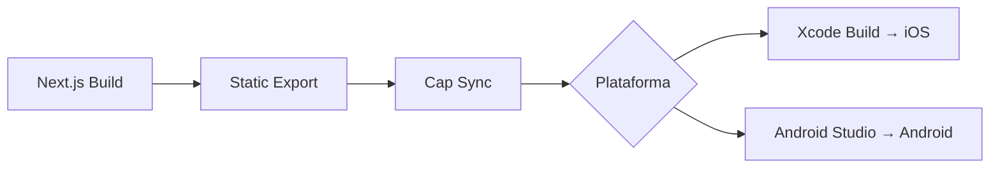

# Capacitor Native — Quest

## Plugins Requeridos

| Plugin | Versión | Propósito |
|--------|---------|-----------|
| `@capacitor/app` | Latest | App lifecycle (background/foreground) |
| `@capacitor/push-notifications` | Latest | Push notifications nativas |
| `@capacitor/status-bar` | Latest | StatusBar control |
| `@capacitor/haptics` | Latest | Feedback háptico |
| `@capacitor/share` | Latest | Compartir contenido |
| `@capacitor/local-notifications` | Latest | Notificaciones locales |
| `@capacitor-community/keep-awake` | Latest | Mantener pantalla encendida (timer) |
| `capacitor-native-biometric` | Latest | Face ID / TouchID / Fingerprint |

---

## Setup Inicial (Fase 4)

```bash
# Instalar Capacitor
pnpm add @capacitor/core @capacitor/cli
npx cap init Quest com.quest.app --web-dir=out

# Agregar plataformas
npx cap add ios
npx cap add android

# Instalar plugins
pnpm add @capacitor/app @capacitor/push-notifications \
  @capacitor/status-bar @capacitor/haptics @capacitor/share \
  @capacitor/local-notifications @capacitor-community/keep-awake \
  capacitor-native-biometric
```

---

## Build Flow



```bash
# Build completo
pnpm build          # Next.js build
npx next export     # Static HTML (output: out/)
npx cap sync        # Copy web → native
npx cap open ios    # Abrir en Xcode
npx cap open android # Abrir en Android Studio
```

---

## Keep-Awake (Timer de Oración)

```typescript
import { KeepAwake } from '@capacitor-community/keep-awake';

// Al iniciar oración
export async function startPrayerTimer() {
  await KeepAwake.keepAwake();
  // ...timer logic
}

// Al terminar/pausar oración
export async function stopPrayerTimer() {
  await KeepAwake.allowSleep();
}
```

---

## App Lifecycle (Background Detection)

```typescript
import { App } from '@capacitor/app';

App.addListener('appStateChange', ({ isActive }) => {
  if (!isActive) {
    // App en background → pausar timer
    pauseTimer();
    showLocalNotification('Tu oración está pausada 🙏');
  } else {
    // App active → reanudar timer
    resumeTimer();
  }
});
```

---

## Notas Importantes

- `output: 'export'` en `next.config.ts` para Capacitor
- Server Actions NO funcionan con static export → migrar a client-side
- Capacitor usa `file://` protocol → configurar CSP
- iOS requiere provisioning profile + signing
- Android requiere keystore para release builds
